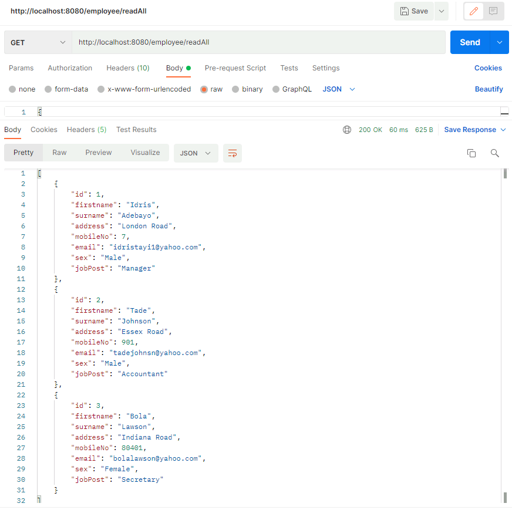
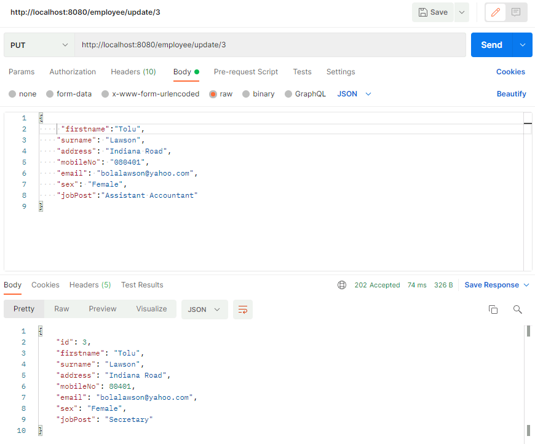
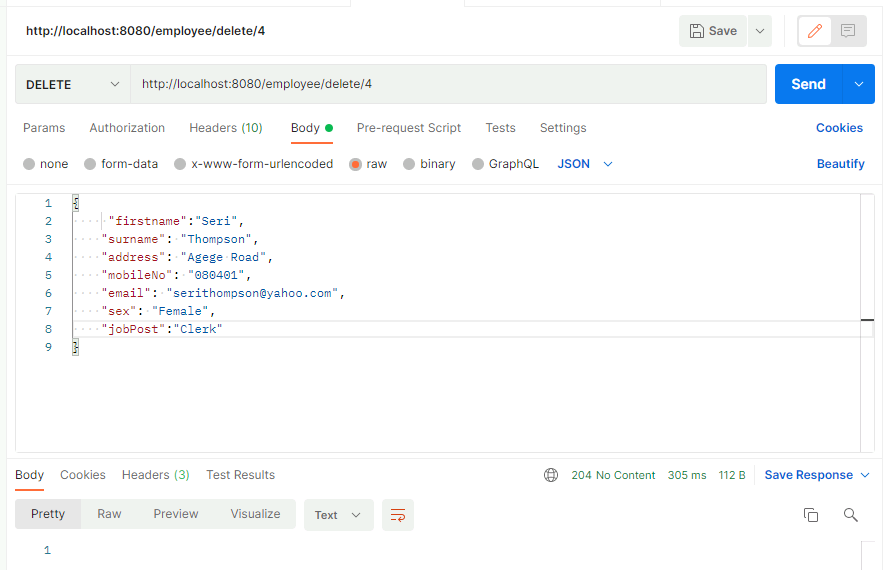
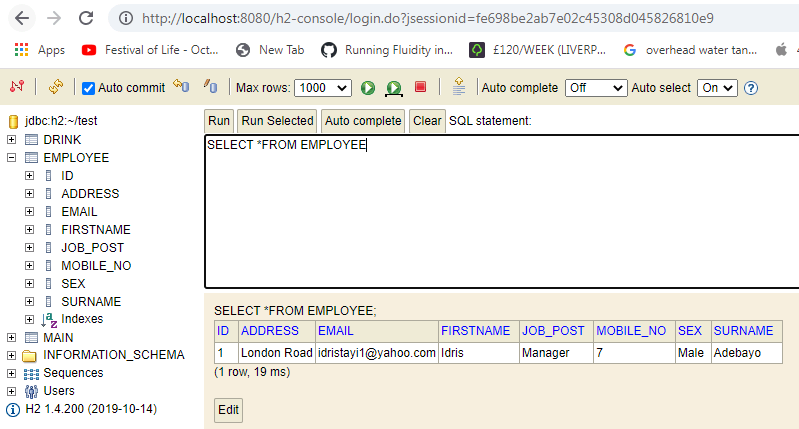

# A Spring Boot Application Back-end with API integration to a Local Database.

# Idris Adebayo

## 09-February-2022

 	

## Project Objective: 
The aim of this project is to develop a Employee Management Spring Boot application which utilises advanced methodologies and technologies for the persistence of data in any field to a remote database for subsequent query when necessary.
The software is written in Java language and has the capacity for the Employers to store, update, retrieve and delete data on different "employers" on a local database. It is integrated with an API which allows online access to this database through series of HTTP requests from a tool called Postman. 
The ability to integrate and store data remotely is fast becoming a must in the present world. Hence, a backend software which can achieve this is quite laudable. In this project, Java programming language (with Spring Boot) has been used due to its versatility and easy of compilation on different computer architectures. 
 
## Screenshots of Postman requests and the output from the API
**Postman call to CREATE new employee data**

**Postman call to READ all employee data entries**

**Postman call to READ employee data by their Id**

**Postman call to UPDATE an employee data entry by the Id**

**Postman call to DELETE an employee data entry by the Id**

**Screenshot of employee data being READ on the H2 console**

